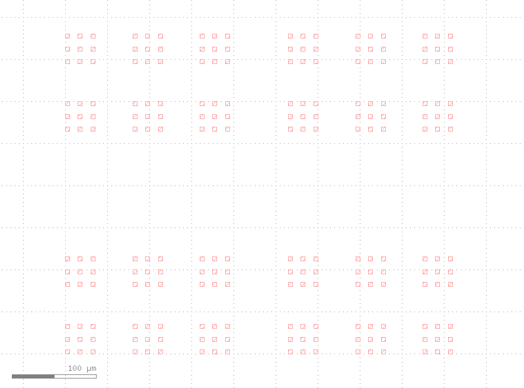
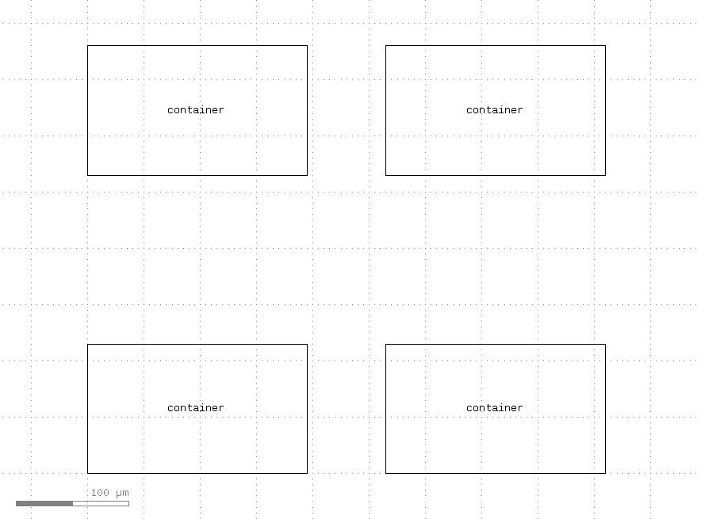

# GDS Hierarchical Pattern Generation Demonstration

本リポジトリでは、GDSII フォーマットの階層的なパターンを生成する方法をデモンストレーションします。gdstk ライブラリを活用し、ネスト構造を含む GDSII ファイルの生成を行います。

## 階層構造

本プログラムでは、以下の 4 階層のパターンを生成します。

### 1. エレメント (Element)

最小単位となる正方形の図形です。



### 2. サブコンテナー (Sub Container)

複数のエレメントを格子状に配置して構成されるパターンです。


### 3. コンテナー (Container)

複数のサブコンテナーを格子状に配置して構成されるパターンです。



### 4. トップレベル (Top Level)

複数のコンテナーを格子状に配置した、最上位のパターンです。


## 必要環境

- Python 3.12 以上
- 依存パッケージ:
  - gdstk

## インストール

下記のコマンドを順に実行してください。

```bash
pip install gdstk
git clone https://github.com/inoueakimitsu/gds-hierarchical-demo.git
cd gds-hierarchical-demo
```

## 使い方

下記のコマンドを実行すると、デフォルト設定を用いたパターンが生成されます。

```bash
python gds_generator.py
```

### 出力ファイル

実行後、以下のファイルが生成されます。

- `output.gds`: GDSII フォーマットのパターン ファイル  
- `output.svg`: 生成したパターンの SVG プレビュー画像

### デフォルト設定

本プログラムでは、以下のデフォルト設定を用いてパターンを生成します。

#### PlacementConfig クラス

パターンの配置設定を管理するクラスです。

- `rows`: 行数  
- `cols`: 列数  
- `spacing`: 要素間の間隔 (nm)

#### デフォルト設定値

```python
DEFAULT_CONFIG = {
    "element": {"size": 5},            # エレメントのサイズ (nm)
    "sub_container": PlacementConfig(rows=2, cols=2, spacing=10),
    "container": PlacementConfig(rows=2, cols=2, spacing=25),
    "top": PlacementConfig(rows=2, cols=2, spacing=50),
}
```

## ライセンス

本プロジェクトは MIT ライセンスの下で公開しています。詳細については [LICENSE](LICENSE) ファイルをご確認ください。
