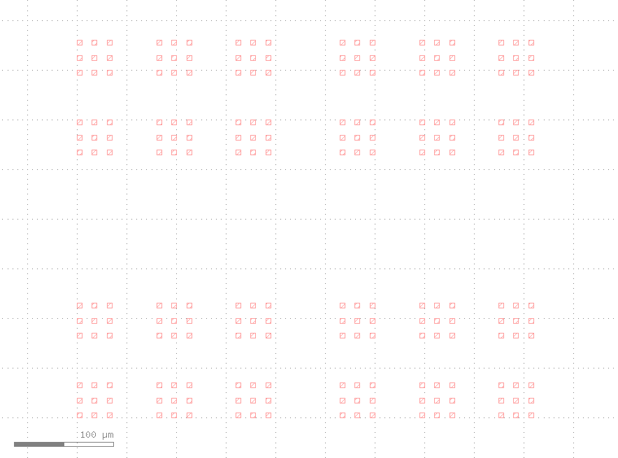
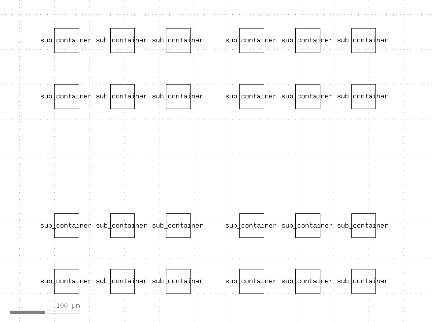
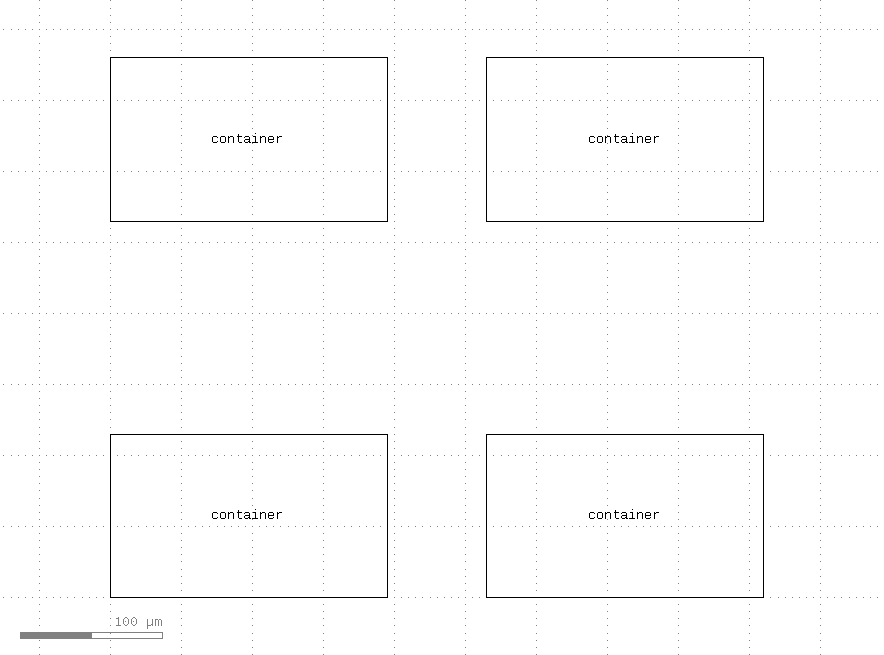
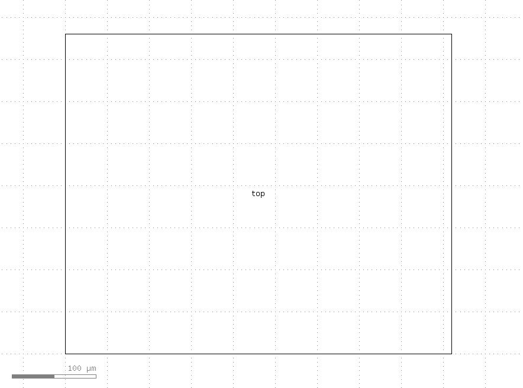

# GDS Hierarchical Pattern Generation Demonstration

This is a demonstration of generating hierarchical patterns in the GDSII format. Using the `gdstk` library, it creates GDSII files with nested patterns.

## Hierarchical Structure

This program generates patterns in four levels of hierarchy.

### 1. Element

A single square pattern, serving as the smallest building block.



### 2. Sub Container

A grid arrangement of multiple Element patterns.



### 3. Container

A grid arrangement of multiple Sub Container patterns.



### 4. Top Level

A grid arrangement of multiple Container patterns at the highest level.



## Technical Requirements

- Python 3.12 or later
- Dependencies:
  - gdstk

## Installation

Use `pip` to install the required packages, then clone this repository:

```
pip install gdstk
git clone https://github.com/inoueakimitsu/gds-hierarchical-demo.git
cd gds-hierarchical-demo
```

## Usage

Run the following command to generate the default pattern:

```
python gds_generator.py
```

### Output Files

Upon execution, the following files are generated:

- `output.gds`: The GDSII pattern file
- `output.svg`: An SVG preview of the pattern

### Default Configuration

By default, the script uses the following settings:

#### `PlacementConfig` Class

This class manages the layout configuration of each pattern:

- `rows`: Number of rows
- `cols`: Number of columns
- `spacing`: Spacing between elements (in nm)

#### Default Settings

```python
DEFAULT_CONFIG = {
    "element": {"size": 5},            # Size of each element (nm)
    "sub_container": PlacementConfig(rows=2, cols=2, spacing=10),
    "container": PlacementConfig(rows=2, cols=2, spacing=25),
    "top": PlacementConfig(rows=2, cols=2, spacing=50),
}
```

## License

This project is released under the MIT License. For more information, please see the [LICENSE](LICENSE) file.
